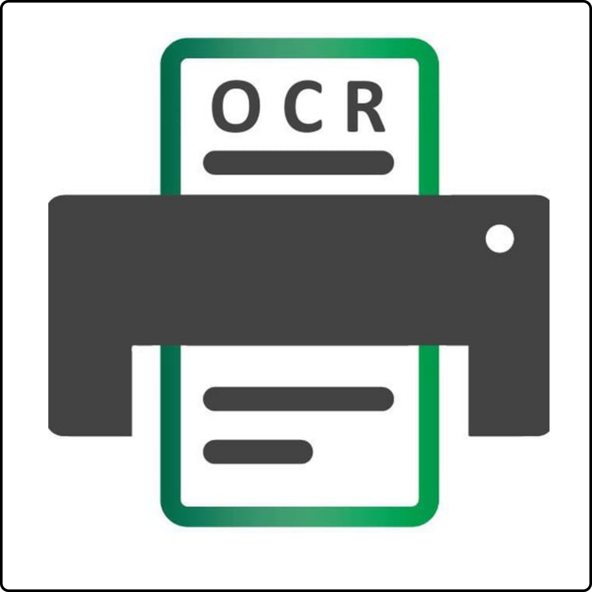

<p align="center">
  
</p>

# Text from image (OCR) [@ocr_text_bot](https://t.me/ocr_text_bot)

A simple bot to extract text from images.

## Usage

### What do I need?
- A AWS key configured locally, see [here](https://serverless.com/framework/docs/providers/aws/guide/credentials/).
- NodeJS. I tested with v8.9.0.
- A Telegram account.

### Installing
```
# Install the Serverless Framework
$ npm install serverless -g

# Install the necessary plugins
$ npm install

# Get a bot from Telegram, sending this message to @BotFather
$ /newbot

# Put the token received into a file called serverless.env.yml, like this
$ cat serverless.env.yml
TELEGRAM_TOKEN: <your_token>

# Deploy it!
$ serverless deploy

# With the URL returned in the output, configure the Webhook
$ curl -X POST https://<your_url>.amazonaws.com/dev/set_webhook
```

Now, just start a conversation with the bot :)

## Acknowledgement

- [Serveless aws-python-telegram-bot example](https://github.com/serverless/examples/tree/master/aws-python-telegram-bot)
- [python-telegram-bot](https://github.com/python-telegram-bot/python-telegram-bot)
- [pytesseract](https://github.com/madmaze/pytesseract)
- [Tesseract](https://github.com/tesseract-ocr/tesseract)
